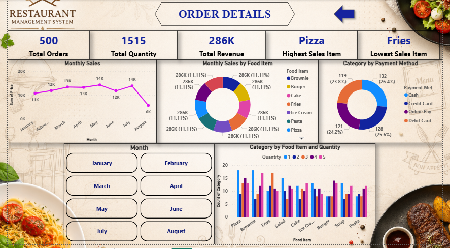

# 🍽️ Restaurant Sales Dashboard | Power BI

## 📌 Project Overview

The *Restaurant Sales Dashboard* is an interactive Power BI project designed to analyze restaurant business performance using data visualization techniques. This dashboard provides valuable insights into sales, revenue, customer orders, menu item performance, and payment methods to support better business decisions.

---

## 🎯 Project Objectives

- Analyze restaurant sales performance
- Monitor monthly revenue trends
- Identify top-selling and low-selling menu items
- Track customer order quantity
- Analyze payment methods
- Build an interactive business dashboard

---

## 📊 Key Performance Indicators (KPIs)

- 📦 Total Orders
- 💰 Total Revenue
- 🍽️ Total Quantity Sold
- ⭐ Highest Selling Item
- 📉 Lowest Selling Item

---

## 📈 Dashboard Features

- Interactive Dashboard
- Monthly Sales Analysis
- Product-wise Revenue Analysis
- Category-wise Sales Analysis
- Payment Method Analysis
- KPI Cards
- Dynamic Filters & Slicers
- Page Navigation
- User-Friendly Dashboard Design

---

## 🛠️ Tools & Technologies Used

- Power BI Desktop
- MySQL Database
- SQL
- Power Query
- DAX (Data Analysis Expressions)
- Data Modeling
- Data Visualization

---

## 🗄️ Database

The project uses a *MySQL Database* as the primary data source. The database contains restaurant sales information including:

- Order Details
- Menu Items
- Categories
- Quantity
- Price
- Payment Methods
- Revenue

---

## 📂 Project Files

- Restaurant.pbix
- Restaurant_Database.sql
- dashboard.png
- README.md

---

## 📷 Dashboard Preview

---

## 📊 Business Insights

- Identified the highest-selling menu items.
- Monitored total revenue and order count.
- Compared different payment methods.
- Analyzed monthly sales trends.
- Evaluated product category performance.
- Improved decision-making through interactive visualizations.

---

## 📁 Repository Structure

Restaurant-Sales-PowerBI-Dashboard/

├── Restaurant.pbix

├── Restaurant_Database.sql

├── dashboard.png

└── README.md

---

## 🚀 Future Enhancements

- Customer Segmentation Dashboard
- Profit & Loss Analysis
- Inventory Dashboard
- Employee Performance Dashboard
- Real-Time Data Integration
- Sales Forecasting

---

## 💼 Skills Demonstrated

- Power BI Dashboard Development
- SQL Query Writing
- MySQL Database Management
- Power Query
- DAX Calculations
- Data Cleaning
- Data Modeling
- Business Intelligence
- Data Visualization

---

## 👩‍💻 Developed By

*Lavanya*

*Power BI Developer | Data Analyst*

---

## ⭐ Support

If you found this project useful, consider giving it a ⭐ on GitHub.

Thank you for visiting this repository!
